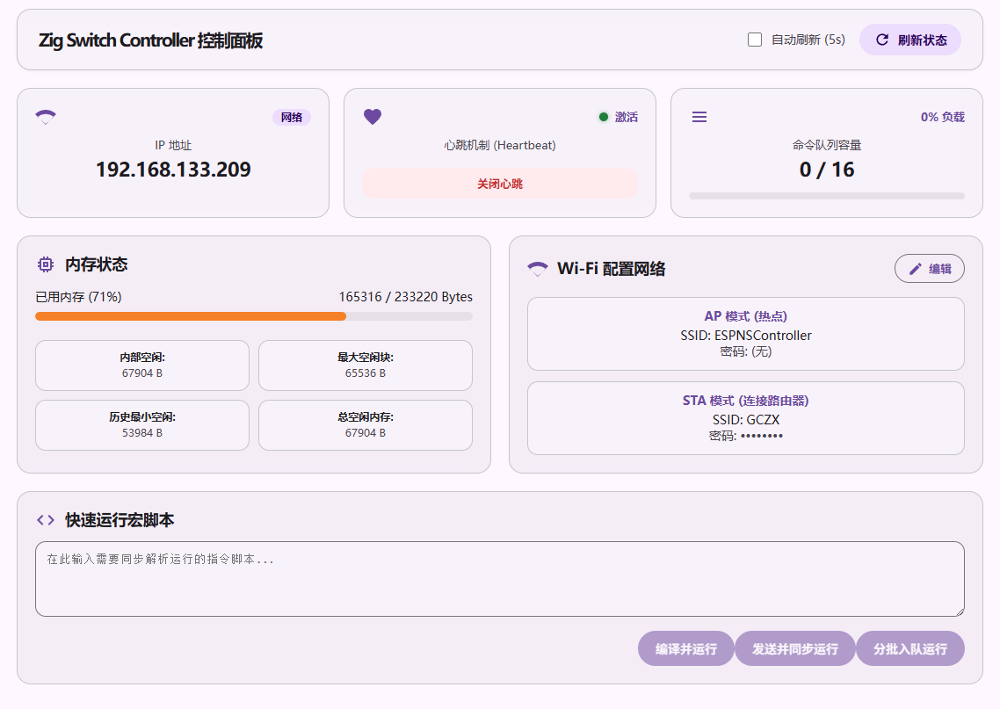

# ESP32 Zig Switch Controller

一个运行在 **ESP32-WROOM-32D** 上的 Nintendo Switch Pro Controller 模拟器,
由 **Zig 0.16.0 + ESP-IDF + ESP32 + Bluetooth Classic HID** 强力驱动.

## 目录

- [ESP32 Zig Switch Controller](#esp32-zig-switch-controller)
  - [目录](#目录)
  - [状态](#状态)
  - [功能](#功能)
  - [架构](#架构)
  - [构建](#构建)
    - [环境准备](#环境准备)
    - [编译](#编译)
    - [烧录](#烧录)
  - [Web](#web)
    - [功能](#功能-1)
    - [访问 Web 页面](#访问-web-页面)
    - [HTTP API](#http-api)
  - [Bluetooth HID](#bluetooth-hid)
  - [命令脚本](#命令脚本)
    - [可用按键名称](#可用按键名称)
    - [可用摇杆名称](#可用摇杆名称)
    - [基础按键输入](#基础按键输入)
    - [组合按键输入](#组合按键输入)
    - [摇杆输入](#摇杆输入)
    - [重复循环](#重复循环)
    - [重置状态](#重置状态)
    - [时间单位](#时间单位)
  - [致谢](#致谢)
  - [声明](#声明)

## 状态

目前还在处于实验性探索阶段.

## 功能

- 🎮 **Nintendo Switch Pro Controller Emulator**
- 📡 **Bluetooth Classic HID**
- 🕹️ 按键、组合键、摇杆控制
- 🌐 Wi-Fi AP/STA
- 🚀 HTTP REST API
- 💾 ESP-IDF NVS 配置
- 🖥️ 网页界面

## 架构

```text
                         ┌─────────────────────┐
                         │       ESP32         │
                         │   Zig + ESP-IDF     │
                         └──────────┬──────────┘
                                    │
              ┌─────────────────────┼─────────────────────┐
              │                     │                     │
              ▼                     ▼                     ▼
        ┌───────────┐        ┌────────────┐       ┌─────────────┐
        │   Wi-Fi   │        │ Bluetooth  │       │    NVS      │
        │  AP / STA │        │ Classic HID│       │   Config    │
        └─────┬─────┘        └─────┬──────┘       └─────────────┘
              │                    │
              ▼                    ▼
        ┌─────────────┐      ┌──────────────┐
        │ HTTP Server │      │ ReportQueue  │
        └──────┬──────┘      └──────┬───────┘
               │                    │
               ▼                    ▼
        ┌─────────────────────────────────┐
        │          Controller             │
        │  Button / Stick / Input State  │
        └───────────────┬─────────────────┘
                        │
                        ▼
              ┌──────────────────┐
              │ Switch Protocol  │
              │  HID / Reports   │
              └────────┬─────────┘
                       │
                       ▼
              ┌──────────────────┐
              │ Nintendo Switch  │
              └──────────────────┘
```

## 构建

### 环境准备

- NodeJs v24.19.0
- npm
- CMake
- Ninja
- ESP-IDF 6.0.2
- [Patched-Zig-Espressif-0.16.0] (可选, 若没有会自动下载)

### 编译

在激活 ESP-IDF 环境以及导出环境变量 `ZIG_DIR` 为你的 ZIG 工具链路径的命令行终端中, 使用以下指令进行编译:

```shell
idf.py set-target esp32
idf.py build
```

若要指定优化等级, 则可以使用

```shell
idf.py reconfigure -DCMAKE_BUILD_TYPE=ReleaseSafe
idf.py build
```

### 烧录

烧录和正常烧录方法一致, 依旧在相同的环境的命令行终端中, 使用

```shell
idf.py -p <PORT> flash
```

## Web

内嵌一个简单的控制面板页面, 用于向 ESP32 发送指令和修改配置.



### 功能

- 查看当前所连 WIFI IP 地址.
- 控制手柄心跳数据包
- 查看 ESP32 的内存状态
- 查看 ESP32 的任务队列
- 修改 WiFi/AP 的名称和密码
- 直接运行命令脚本
- 编译命令脚本为字节码后执行
- 将命令脚本分组后依次编译并加入工作队列

### 访问 Web 页面

本固件默认会开放一个 WIFI 热点, 在连入这个 WIFI 热点后可以访问 [http://192.168.4.1](http://192.168.4.1) 进入 Web 页面.

若 ESP32 连接到了 WIFI, 则可以先通过上一步获取道 ESP32 的 IP 地址后, 再由这个 IP 地址进行访问.

### HTTP API

设备启动 HTTP Server 后，可以通过 HTTP API 控制 Controller。

| Method | Endpoint | Description |
| --- | --- | --- |
| `GET` | `/` | API / Web 根入口 |
| `GET` | `/api?mode=/ip` | 获取连接到的 WI-FI 的 IP 地址 |
| `GET` | `/api?mode=/memory` | 获取 ESP32 的堆内存信息 |
| `GET` | `/api?mode=/cfg/wifi` | 获取 Wi-Fi 配置 |
| `GET` | `/api?mode=/cmd/queue` | 获取字节码队列容量 |
| `POST` | `/api?mode=/cfg/wifi` | 更新 Wi-Fi 配置 |
| `POST` | `/api?mode=/cmd/queue` | 将控制器指令字节码推送到执行队列 |
| `POST` | `/api?mode=/cmd/run` | 直接执行指令脚本字节码 |
| `POST` | `/api?mode=/cmd/run/raw` | 直接执行指令脚本 |
| `POST` | `/api?mode=/cmd/test` | 测试指令字节码 |

## Bluetooth HID

ESP32 通过 Bluetooth Classic HID Device 模拟：

```text
Nintendo Pro Controller
```

默认设备信息：

```text
Name:        Pro Controller
Description: Gamepad
Provider:    Nintendo
```

## 命令脚本

可以使用简单的文本命令控制手柄。

### 可用按键名称

| 图标 | 按键名称 | 描述 |
|:-:|:-:|:-:|
|<svg xmlns="http://www.w3.org/2000/svg" viewBox="0 0 32 32" width="32" height="32" style="vertical-align: middle;"><circle cx="16" cy="16" r="13" fill="#2d3035" stroke="#1a1c1e" stroke-width="1"/><circle cx="16" cy="16" r="12" fill="none" stroke="#43474e" stroke-width="0.7"/><text x="16" y="17" font-family="Arial, sans-serif" font-weight="bold" font-size="12" fill="#ffffff" text-anchor="middle" dominant-baseline="middle">A</text></svg>|A|A键（确认键）|
|<svg xmlns="http://www.w3.org/2000/svg" viewBox="0 0 32 32" width="32" height="32" style="vertical-align: middle;"><circle cx="16" cy="16" r="13" fill="#2d3035" stroke="#1a1c1e" stroke-width="1"/><circle cx="16" cy="16" r="12" fill="none" stroke="#43474e" stroke-width="0.7"/><text x="16" y="17" font-family="Arial, sans-serif" font-weight="bold" font-size="12" fill="#ffffff" text-anchor="middle" dominant-baseline="middle">B</text></svg>|B|B键（取消键）|
|<svg xmlns="http://www.w3.org/2000/svg" viewBox="0 0 32 32" width="32" height="32" style="vertical-align: middle;"><circle cx="16" cy="16" r="13" fill="#2d3035" stroke="#1a1c1e" stroke-width="1"/><circle cx="16" cy="16" r="12" fill="none" stroke="#43474e" stroke-width="0.7"/><text x="16" y="17" font-family="Arial, sans-serif" font-weight="bold" font-size="12" fill="#ffffff" text-anchor="middle" dominant-baseline="middle">X</text></svg>|X|X键（特殊功能键）|
|<svg xmlns="http://www.w3.org/2000/svg" viewBox="0 0 32 32" width="32" height="32" style="vertical-align: middle;"><circle cx="16" cy="16" r="13" fill="#2d3035" stroke="#1a1c1e" stroke-width="1"/><circle cx="16" cy="16" r="12" fill="none" stroke="#43474e" stroke-width="0.7"/><text x="16" y="17" font-family="Arial, sans-serif" font-weight="bold" font-size="12" fill="#ffffff" text-anchor="middle" dominant-baseline="middle">Y</text></svg>|Y|Y键（菜单键）|
|<svg xmlns="http://www.w3.org/2000/svg" viewBox="0 0 32 32" width="32" height="32" style="vertical-align: middle;"><circle cx="16" cy="16" r="11" fill="#2d3035" stroke="#1a1c1e" stroke-width="1"/><path d="M 16,11 V 21 M 11,16 H 21" stroke="#ffffff" stroke-width="3" stroke-linecap="round"/></svg>|PLUS|加号键（开始键）|
|<svg xmlns="http://www.w3.org/2000/svg" viewBox="0 0 32 32" width="32" height="32" style="vertical-align: middle;"><circle cx="16" cy="16" r="11" fill="#2d3035" stroke="#1a1c1e" stroke-width="1"/><path d="M 11,16 H 21" stroke="#ffffff" stroke-width="3" stroke-linecap="round"/></svg>|MINUS|减号键（返回键）|
|<svg xmlns="http://www.w3.org/2000/svg" viewBox="0 0 32 32" width="32" height="32" style="vertical-align: middle;"><circle cx="16" cy="16" r="13" fill="#2d3035" stroke="#1a1c1e" stroke-width="1"/><circle cx="16" cy="16" r="15" fill="none" stroke="#e65c00" stroke-width="1"/><!-- 屋顶与房屋结构 --><path d="M 16,10 L 9,16 H 11 V 22 H 21 V 16 H 23 Z" fill="#ffffff"/></svg>|HOME|主菜单键|
|<svg xmlns="http://www.w3.org/2000/svg" viewBox="0 0 32 32" width="32" height="32" style="vertical-align: middle;"><rect x="4" y="4" width="24" height="24" rx="3" fill="#2d3035" stroke="#1a1c1e" stroke-width="1"/><circle cx="16" cy="16" r="7" fill="none" stroke="#ffffff" stroke-width="2"/></svg>|CAPTURE|截图键|
|<svg xmlns="http://www.w3.org/2000/svg" viewBox="0 0 32 32" width="32" height="32" style="vertical-align: middle;"><path d="M 3,21 Q 3,8 16,8 Q 29,8 29,21 Z" fill="#2d3035" stroke="#1a1c1e" stroke-width="1"/><path d="M 5,19 Q 5,10 16,10 Q 27,10 27,19 Z" fill="none" stroke="#43474e" stroke-width="0.7"/><text x="16" y="16" font-family="Arial, sans-serif" font-weight="bold" font-size="9" fill="#ffffff" text-anchor="middle" dominant-baseline="middle">L</text></svg>|L|左肩键|
|<svg xmlns="http://www.w3.org/2000/svg" viewBox="0 0 32 32" width="32" height="32" style="vertical-align: middle;"><rect x="2" y="3" width="28" height="26" rx="6" fill="#2d3035" stroke="#1a1c1e" stroke-width="1"/><rect x="3" y="4" width="26" height="24" rx="5" fill="none" stroke="#43474e" stroke-width="0.7"/><text x="16" y="19" font-family="Arial, sans-serif" font-weight="bold" font-size="11" fill="#ffffff" text-anchor="middle" dominant-baseline="middle">ZL</text></svg>|ZL|左肩键（左Z触发器）|
|<svg xmlns="http://www.w3.org/2000/svg" viewBox="0 0 32 32" width="32" height="32" style="vertical-align: middle;"><path d="M 3,21 Q 3,8 16,8 Q 29,8 29,21 Z" fill="#2d3035" stroke="#1a1c1e" stroke-width="1"/><path d="M 5,19 Q 5,10 16,10 Q 27,10 27,19 Z" fill="none" stroke="#43474e" stroke-width="0.7"/><text x="16" y="16" font-family="Arial, sans-serif" font-weight="bold" font-size="9" fill="#ffffff" text-anchor="middle" dominant-baseline="middle">R</text></svg>|R|右肩键|
|<svg xmlns="http://www.w3.org/2000/svg" viewBox="0 0 32 32" width="32" height="32" style="vertical-align: middle;"><rect x="2" y="3" width="28" height="26" rx="6" fill="#2d3035" stroke="#1a1c1e" stroke-width="1"/><rect x="3" y="4" width="26" height="24" rx="5" fill="none" stroke="#43474e" stroke-width="0.7"/><text x="16" y="19" font-family="Arial, sans-serif" font-weight="bold" font-size="11" fill="#ffffff" text-anchor="middle" dominant-baseline="middle">ZR</text></svg>|ZR|右肩键（右Z触发器）|
|<svg xmlns="http://www.w3.org/2000/svg" viewBox="0 0 32 32" width="32" height="32" style="vertical-align: middle;"><circle cx="16" cy="16" r="13" fill="#2d3035" stroke="#1a1c1e" stroke-width="1"/><circle cx="16" cy="16" r="11" fill="none" stroke="#5a5e66" stroke-width="1" stroke-dasharray="2 1"/><text x="16" y="17" font-family="Arial, sans-serif" font-weight="bold" font-size="7" fill="#ffffff" text-anchor="middle" dominant-baseline="middle">L3</text></svg>|L_STICK_PRESSED|左摇杆按下|
|<svg xmlns="http://www.w3.org/2000/svg" viewBox="0 0 32 32" width="32" height="32" style="vertical-align: middle;"><rect x="3" y="10" width="26" height="13" rx="7" fill="#2d3035" stroke="#1a1c1e" stroke-width="1"/><text x="16" y="17" font-family="Arial, sans-serif" font-weight="bold" font-size="7" fill="#ffffff" text-anchor="middle" dominant-baseline="middle">SL</text></svg>|JCL_SL|左摇杆按键|
|<svg xmlns="http://www.w3.org/2000/svg" viewBox="0 0 32 32" width="32" height="32" style="vertical-align: middle;"><rect x="3" y="10" width="26" height="13" rx="7" fill="#2d3035" stroke="#1a1c1e" stroke-width="1"/><text x="16" y="17" font-family="Arial, sans-serif" font-weight="bold" font-size="7" fill="#ffffff" text-anchor="middle" dominant-baseline="middle">SR</text></svg>|JCL_SR|左摇杆按键|
|<svg xmlns="http://www.w3.org/2000/svg" viewBox="0 0 32 32" width="32" height="32" style="vertical-align: middle;"><circle cx="16" cy="16" r="13" fill="#2d3035" stroke="#1a1c1e" stroke-width="1"/><circle cx="16" cy="16" r="11" fill="none" stroke="#5a5e66" stroke-width="1" stroke-dasharray="2 1"/><text x="16" y="17" font-family="Arial, sans-serif" font-weight="bold" font-size="7" fill="#ffffff" text-anchor="middle" dominant-baseline="middle">R3</text></svg>|R_STICK_PRESSED|右摇杆按下|
|<svg xmlns="http://www.w3.org/2000/svg" viewBox="0 0 32 32" width="32" height="32" style="vertical-align: middle;"><rect x="3" y="10" width="26" height="13" rx="7" fill="#2d3035" stroke="#1a1c1e" stroke-width="1"/><text x="16" y="17" font-family="Arial, sans-serif" font-weight="bold" font-size="7" fill="#ffffff" text-anchor="middle" dominant-baseline="middle">SL</text></svg>|JCR_SL|右摇杆按键|
|<svg xmlns="http://www.w3.org/2000/svg" viewBox="0 0 32 32" width="32" height="32" style="vertical-align: middle;"><rect x="3" y="10" width="26" height="13" rx="7" fill="#2d3035" stroke="#1a1c1e" stroke-width="1"/><text x="16" y="17" font-family="Arial, sans-serif" font-weight="bold" font-size="7" fill="#ffffff" text-anchor="middle" dominant-baseline="middle">SR</text></svg>|JCR_SR|右摇杆按键|
|<svg xmlns="http://www.w3.org/2000/svg" viewBox="0 0 32 32" width="32" height="32" style="vertical-align: middle;"><circle cx="16" cy="16" r="13" fill="#2d3035" stroke="#1a1c1e" stroke-width="1"/><polygon points="20,10 10,16 20,22" fill="#ffffff"/></svg>|DPAD_LEFT|方向键左|
|<svg xmlns="http://www.w3.org/2000/svg" viewBox="0 0 32 32" width="32" height="32" style="vertical-align: middle;"><circle cx="16" cy="16" r="13" fill="#2d3035" stroke="#1a1c1e" stroke-width="1"/><polygon points="12,10 22,16 12,22" fill="#ffffff"/></svg>|DPAD_RIGHT|方向键右|
|<svg xmlns="http://www.w3.org/2000/svg" viewBox="0 0 32 32" width="32" height="32" style="vertical-align: middle;"><circle cx="16" cy="16" r="13" fill="#2d3035" stroke="#1a1c1e" stroke-width="1"/><polygon points="10,20 16,10 22,20" fill="#ffffff"/></svg>|DPAD_UP|方向键上|
|<svg xmlns="http://www.w3.org/2000/svg" viewBox="0 0 32 32" width="32" height="32" style="vertical-align: middle;"><circle cx="16" cy="16" r="13" fill="#2d3035" stroke="#1a1c1e" stroke-width="1"/><polygon points="10,12 16,22 22,12" fill="#ffffff"/></svg>|DPAD_DOWN|方向键下|

### 可用摇杆名称

| 图标 | 按键名称 | 描述 |
|:-:|:-:|:-:|
|<svg xmlns="http://www.w3.org/2000/svg" viewBox="0 0 32 32" width="32" height="32" style="vertical-align: middle;"><circle cx="16" cy="16" r="13" fill="#2d3035" stroke="#1a1c1e" stroke-width="1"/><circle cx="16" cy="16" r="11" fill="none" stroke="#5a5e66" stroke-width="1" stroke-dasharray="2 1"/><text x="16" y="17" font-family="Arial, sans-serif" font-weight="bold" font-size="7" fill="#ffffff" text-anchor="middle" dominant-baseline="middle">L</text></svg>|LEFT_STICK|左摇杆|
|<svg xmlns="http://www.w3.org/2000/svg" viewBox="0 0 32 32" width="32" height="32" style="vertical-align: middle;"><circle cx="16" cy="16" r="13" fill="#2d3035" stroke="#1a1c1e" stroke-width="1"/><circle cx="16" cy="16" r="11" fill="none" stroke="#5a5e66" stroke-width="1" stroke-dasharray="2 1"/><text x="16" y="17" font-family="Arial, sans-serif" font-weight="bold" font-size="7" fill="#ffffff" text-anchor="middle" dominant-baseline="middle">R</text></svg>|RIGHT_STICK|右摇杆|

### 基础按键输入

按下 **A** 等待 100 毫秒后弹起.

```text
DOWN A
WAIT 100ms
UP A
```

等价于

```text
TAP 100ms 0ms A
```

### 组合按键输入

按下 **L** 的同时一起按下 **R**, 并等待 100 毫秒后弹起.

```text
DOWN L R
WAIT 100ms
UP L R
WAIT 50ms
```

等价于

```text
TAP 100ms 50ms L R
```

### 摇杆输入

```text
STICK <摇杆> <X轴> <Y轴>
```

- 摇杆类型:
  - 左摇杆: `left_stick`
  - 右摇杆: `right_stick`
- X/Y 轴: [-100, 100] 整数

### 重复循环

循环 5 次按下 **A**

```text
REPEAT 5
    DOWN A
    WAIT 100ms
    UP A
    WAIT 100ms
END
```

### 重置状态

- 重置按键: `RESET_BUTTON`
- 摇杆归位: `RESET_STICK <摇杆>`
- 重置所有: `RESET_ALL`

### 时间单位

支持：

```text
100ms
1s
1.5s
2m
1h
```

如果不指定单位，则默认使用毫秒：

```text
WAIT 100
```

## 致谢

这个项目存在离不开这些仓库的所有贡献者的奉献:

- [zig-espressif-bootstrap]
- [zig-esp-idf-sample]
- [nxbt]
- [nuxbt]
- [Nintendo_Switch_Reverse_Engineering]

## 声明

本项目仅作为个人学习研究为目的

[Patched-Zig-Espressif-0.16.0]: https://github.com/SmileYik/zig-espressif-bootstrap/releases/tag/0.16.0
[zig-espressif-bootstrap]: https://github.com/kassane/zig-espressif-bootstrap
[zig-esp-idf-sample]: https://github.com/kassane/zig-esp-idf-sample
[nxbt]: https://github.com/Brikwerk/nxbt
[nuxbt]: https://github.com/hannahbee91/nuxbt
[Nintendo_Switch_Reverse_Engineering]: https://github.com/dekuNukem/Nintendo_Switch_Reverse_Engineering
